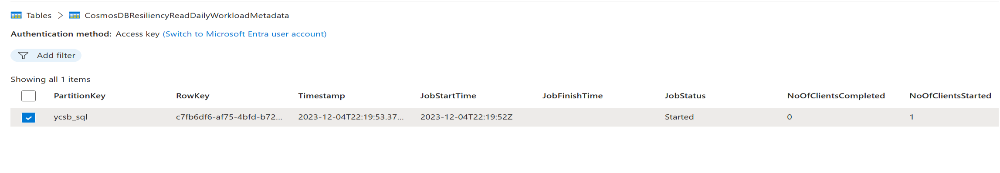
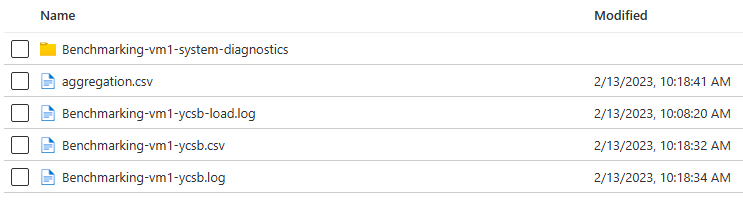

## Overview
[YCSB](https://github.com/brianfrankcooper/YCSB) is a popular java based open-source benchmarking tool for performance benchmarking NoSQL databases. The provided recipes encapsulate the workload definitions that are passed to YCSB. When using YCSB directly, sometimes the load phase needs to be executed before the run phase. The framework combines the load and run phases to provide a one-click experience. [Azure CLI](https://learn.microsoft.com/en-us/cli/azure/install-azure-cli) can also be used to execute the recipes. As you can see above, the recipes are organized by workload type and each recipe comes with instructions to help you execute them.

Next section walks you through the process of executing a small read recipe to familiarize you with the framework before you start with the actual recipes. If you feel comfortable you can skip this step and move to the actual recipes. 
 - [read-recipes](./read)
 - [write-recipes](./write)
 - [update-recipes](./update)

## Try It 
A read recipe with a small read workload to familiarize you with the framework. The results should be available in 15-20 minutes after initiating the deployment.

1. Create a [Mongo DB collection](https://learn.microsoft.com/en-us/azure/cosmos-db/mongodb/quickstart-java)

   |  Setting   |  value  | 
   | :--:  | :--:  |
   | Database Name | ycsb | 
   | Container Name | usertable | 
   | Partition Key  |  _id |
   | Container Throughput  | Manual |  
   | Throughput | 400 RU/s | 
   
   
2. Create a [storage account](https://learn.microsoft.com/en-us/azure/storage/common/storage-account-create?tabs=azure-portal) and note down the connection string 
3. Create a [resource group](https://learn.microsoft.com/en-us/azure/azure-resource-manager/management/manage-resource-groups-portal) in the same region as the Cosmos DB account 
4. Click the deploy to Azure button and fill in the following missing parameter values:

   |  Parameter   |  Value  |
   | :--:  | :--:  |
   | Resource group | name of the resource group from spet 3 |
   | Region | Make sure the region is the same as the Cosmos DB account region |
   | Results Storage Connection String | connection string of the storage account from step 2 |
   | Cosmos Connection String  | Primary Connection String for the account from step 1 |
   | Admin Password | Admin account password |

   [](https://portal.azure.com/#create/Microsoft.Template/uri/https%3A%2F%2Fraw.githubusercontent.com%2FAzure%2Fazure-db-benchmarking%2Fmain%2Fcosmos%2Fmongoapi%2Ftools%2Fjava%2Fycsb%2Frecipes%2Fread%2Ftry-it-read%2Fazuredeploy.json)

5. Alternatively, you can execute the recipe using [Azure CLI](https://learn.microsoft.com/en-us/cli/azure/install-azure-cli). 

    -  Pass parameters inline:
     ```
     az deployment group create \
        --resource-group "<resource-group-name>" \
        --name "<deploymen-name>" \
        --template-uri "https://raw.githubusercontent.com/Azure/azure-db-benchmarking/main/cosmos/mongoapi/tools/java/ycsb/recipes/read/try-it-read/azuredeploy.json" \
        --parameters \
	         adminPassword="<VM-Password>" \
	         resultsStorageConnectionString="<Results-Storage-Connection-String>" \
	         cosmosConnectionString="<Primary-Connection-String>"             
      ```
   - Create a paratemetr file or use the provided [sample parameter file](./parameter-files) to execute the recipe. Be sure to populate the parameter values in the parameter file.

    ```
     az deployment group create \
        --resource-group <resource-group-name> \
        --name <deploymen-name> \
        --template-uri "https://raw.githubusercontent.com/Azure/azure-db-benchmarking/main/cosmos/mongoapi/tools/java/ycsb/recipes/read/try-it-read/azuredeploy.json" \
        --parameters parameter.json
    ```

6. Navigate to the storage account created in step 2 to see the job status and results.

   - Job status can be found by browsing to the table in table storage browser 
   
     
 
   - Once the job status says "Finished", results will be availabe in a container within the same storage account
   
     
   
   - aggregation.csv has the aggregated results from all clients
    
     
   
   - There will be a folder per VM with the detailed system diagnostics logs. These logs will help you diagnose issues. Check [common errors](#common-errors) section for details on errors.

     


7. re-executing the recipe by setting "Skip Load Phase" to "true" , while leaving the rest of the parameter values unchanged, will execute just the read phase of the workload again, using the VM from the previous execution. 

## Common Errors
Following are the most common user mistakes that lead to errors. The error logs will be available in a container within the storage account provided. The only exception being the first error listed below. A unreachable storage account. In which case, the longs will be available only in the VM.

1. Following error will appear in "agent.err" in the "/home/benchmarking" of the client VM, if a incorrect storage connecting is passed. 
   ```
   Error while accessing storage account, exiting from this machine in agent.out on the VM 
   ```
2. Following error will appear in "agent.out" in the VM and in a folder within the results storage container if the Cosmos DB URI is incorrect or unreachable 
   ```
   Caused by: java.net.UnknownHostException: rtcosmosdbsss.documents.azure.com: Name or service not known 
   ```
3. Following error will appear in "agent.out" in the VM and in a folder within the results storage container if the Cosmos DB Key is incorrect
   ```
   The input authorization token can't serve the request. The wrong key is being used….
   
 ## Monitoring
Once a benchmarking job is triggered its status and few useful properties will be available in a storage table named "ycsbbenchmarkingMetadata". Each row represents one benchmarking job. A job can have one or more clients, each running on its own VM. The number of clients will always equal number of VMs. 

   |  Key   |  Description  | 
   | :--:  | :--: |
   | JobStartTime | Start time of the job | 
   | JobFinishTime | Finish time of the job | 
   | JobStatus| can be either "Started" or "Finished"| 
   | NoOfClientsStarted | Total number of clients used for the Job |
   | NoOfClientsCompleted | Total number of clients that completed their workload task | 


## Results 
Once the "JobStatus" key has a value of "Finished", the results will be available in a newly created container, with a name of the format "ycsbbenchmarking-<Date>".
   
   |  File   |  Description  | 
   | :--:  | :--:  |
   | aggregation.csv | aggregated result from all the clients |    
   | Benchmarking-vm<n>-ycsb.log| YCSB log file for the run phase. There will be as many files as the clients| 
   | Benchmarking-vm<n>-ycsb.csv | an intermediary CSV file generated from the YCSB log file. Used to produce the final aggregated results | 
