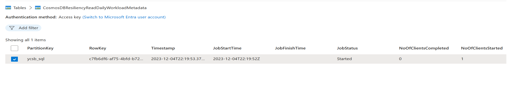
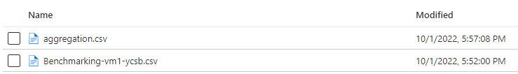
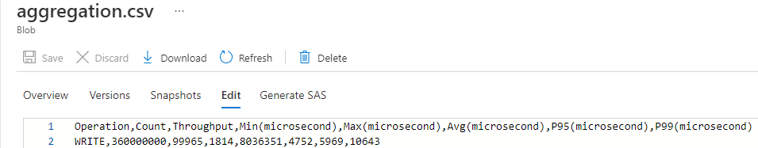

## Overview
[YCSB](https://github.com/Azure/YCSB) is a popular java based open-source benchmarking tool for performance benchmarking NoSQL databases. This page provides all the details required to use the benchmarking framework with YCSB. 

## Try it
1. Create a [Cosmos DB SQL API account](https://learn.microsoft.com/en-us/azure/cosmos-db/nosql/quickstart-portal), with a database "ycsb" and container "usertable" with manual throughput of 400 RU/s. Note down the endpoint and primary key
3. Create a [storage account](https://learn.microsoft.com/en-us/azure/storage/common/storage-account-create?tabs=azure-portal) and note down the connection string 
4. Create a [resource group](https://learn.microsoft.com/en-us/azure/azure-resource-manager/management/manage-resource-groups-portal) in the same region as the Cosmos DB account 
5. Click the deploy to Azure button and fill in the following missing parameter values:

   |  Parameter   |  Value  |
   | --- | --- |
   | Resource group | name of the resource group from spet 3 |
   | Results Storage Connection String | connection string of the storage account from step 2 |
   | Cosmos URI  | URI of the Cosmos DB account from step 1 |
   | Cosmos Key  | Primary key of the Cosmos DB account from step 1 |
   | Admin Password | Admin account password |

   

5. Navigate to the storage account created in step 2 to see the jobs status and results.

   - Job status can be found by browsing to the table in table storage browser 
   
     
 
   - Once the job status says "Finished", results will be availabe in a container within the same storage account
   
     
   
   - aggregation.csv has the aggregated results from all clients
    
     

## Recipes
The provided recipes encapsulate the workload configurations that are passed to YCSB for a one click experience. The workload definitions were designed based on the best practices published by Cosmos DB team and YCSB. The recipes have been tested and validated for consistent results.

When using YCSB directly, the load phase needs to be executed before the run phase. The recipes combine the load and run phases to provide a one-click experience.

## Basic Configuration
   
   |  Parameter   |  Default Value  | Description |
   | --- | --- | ---| 
   | Project Name | Benchmarking | this will become part of the VM name(ex: Benchmarking-vm1 ) |
   | Location | [resourceGroup().location] | location of the resource group |
   | Results Storage Connection String  |  | connection string of a storage account |
   | Cosmos Key  |  | URI of the Cosmos DB account |
   | VM Size  | varies by recipe | VM size |
   | VM Count | varies by recipe | Number of VMs |
   | Admin Username | benchmarking | The username for the VM's admin account |
   | Admin Password |  | password for the VM's admin account |
   | Threads | varies by recipe | Number of YCSB client threads  |
   | YCSB Record Count |varies by recipe |Number of records in the dataset at the start of the workload. Used when loading for read workloads|  
   | Target Operations Per Second |varies by recipe | Maximum number of operations per second to be performed by each client/vm |
   | YCSB Operation Count  |varies by recipe |The number of operations to perform in the workload by each client/vm|
   | YCSB Git Hub Repo Name | Azure/YCSB |GitHub repository name for fetching YCSB code|
   | YCSB Git Hub Branch Name | main |GitHub branch name for fetching YCSB code |
   | Benchmarking Tools Repo Name |Azure/azure-db-benchmarking | GitHub repository name for benchmarking framwork code |
   | Benchmarking Tools Branch Name | main | GitHub branch name for benchmarking framwork code |
   | Skip Load Phase | varies by recipe | "True" will skip the YCSB load pshase |
   
## Advanced Configuration
   The default configuration is used to create a VNet and Subnet, but custom configuration can be provided.
   |  Parameter   |  Default Value  | Description |
   | --- | --- | ---| 
   | Vnet Name | [concat(parameters('projectName'), '-vnet')] | VNet name |
   | Vnet Address Prefixes | 10.2.0.0/16 | VNet address prefix |   
   | Vnet Subnet Name | default | subnet name | 
   | Vnet Subnet Address Prefix | 10.2.0.0/24 |  subnet address prefix |
   
## Monitoring
Once a benchmarking job is triggered its status and few useful properties will be available in a storage table named "ycsbbenchmarkingMetadata". Each row represents one benchmarking job. A job can have one or more clients, each running on its own VM. The number of clients will always equal number of VMs. 

   |  Key   |  Description  | 
   | --- | --- |
   | JobStartTime | Start time of the job | 
   | JobFinishTime | Finish time of the job | 
   | JobStatus| can be either "Started" or "Finished"| 
   | NoOfClientsStarted | Total number of clients used for the Job |
   | NoOfClientsCompleted | Total number of clients that completed their workload task | 

## Results 
After the job finishes, the results will be available in a newly created container, with a name of the format "ycsbbenchmarking-<Date>".
   
   |  File   |  Description  | 
   | --- | --- |
   | aggregation.csv | aggregated result from all the clients |    
   | Benchmarking-vm<n>-ycsb.log| YCSB log file for the run phase. There will be as many files as the clients| 
   | Benchmarking-vm<n>-ycsb.csv | an intermediary CSV file generated from the YCSB log file. Used to produce the final aggregated results | 

  
   
