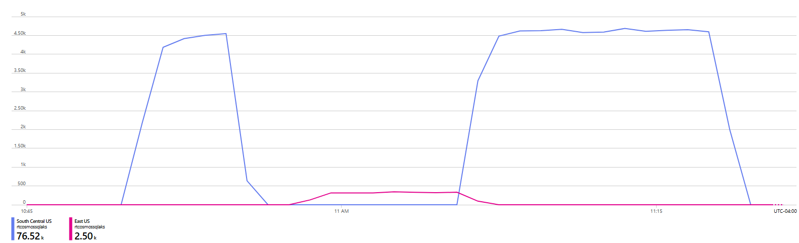
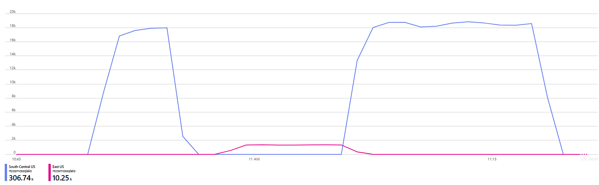

# Simulate network outage for a mixed(read & patch) workload with multi-master account

This recipe encapsulates a mixed workload consisting of both read and patch operations that execute for 20-25 minutes. Around 5 minutes into the execution a regional outage is simulated by dropping all the packets bound to the specified region. The client/SDK detects the outage, marks the region as unavailable for reads and writes, and routes both the read and write requests to the next available region. 

## Recipe definition 

|  Config   |  Value   |
| --- | --- |
| Database | Cosmos SQL API |
| Benchmarking tool | YCSB |
| Workload | Read & Patch (80:20) |
| Duration | 20-25 minutes |
| Fault Type | Packet Drop |
| Fault Start | 5 Minutes after the workload starts |
| Fault duration | 5 minutes |
| Number of documents in DB | 30 |
| Document Size | ≈1 KB(YCSB default) |

## Execute
1. Create a [Cosmos DB SQL API account and container](https://learn.microsoft.com/en-us/azure/cosmos-db/nosql/quickstart-portal)

   |  Setting   |  value  | 
   | --- | --- | 
   | Multi-region Writes | enable |  
   | Database Name | ycsb | 
   | Container Name | usertable | 
   | Partition Key  | /id |
   | Container throughput | 2000 RU/s |

3. Create a [storage account](https://learn.microsoft.com/en-us/azure/storage/common/storage-account-create?tabs=azure-portal) 
4. Create a [resource group](https://learn.microsoft.com/en-us/azure/azure-resource-manager/management/manage-resource-groups-portal) in the same region as the Cosmos DB account 
5. Click the deploy to Azure button and fill in the following missing parameter values:

   |  Parameter   |  Value  |
   | --- | --- |
   | Resource group | name of the resource group from step 3 |
   | Region | Make sure the region is the same as the Cosmos DB account primary region |
   | Results Storage Connection String | connection string of the storage account from step 2 |
   | Cosmos URI  | URI of the Cosmos DB account from step 1 |
   | Cosmos Key  | Primary key of the Cosmos DB account from step 1 |
   | Admin Password | Admin account password for the VM |
   | Preferred Region List | Comma separated preferred regions list. Ex: South Central US,East US. [More about SDKs Failover configuration](https://learn.microsoft.com/en-us/azure/cosmos-db/nosql/troubleshoot-sdk-availability) |
   | dropProbability | Percentage of packets to drop (0-1) |
   | faultRegion | Region which should experience the fault. Ex: South Central US |
   | waitForFaultToStartInSec | Time in seconds to wait before starting the fault |
   | durationOfFaultInSec| Duration of the fault in seconds |
   
 [More details about the parameters](../../#basic-configuration)

## Output
You can visualize the total request count by region by creating a [Azure Monitor metrics chart](https://learn.microsoft.com/en-us/azure/azure-monitor/essentials/metrics-getting-started). You will initially see the requests going to the first region in the "Preferred Regions List" before the requests getting routed to the next available region in the "Preferred Regions List" assuming that the fault is active in the first region and the account is configured for multi-master.

### Patch

### Read
 

| Type | Location |
| --- | --- |
| Status  | ycsbbenchmarkingMetadata (Table) |
| Results | ycsbbenchmarking-{Date} (Container) |

 [More details about job status and results](../../#monitoring)
